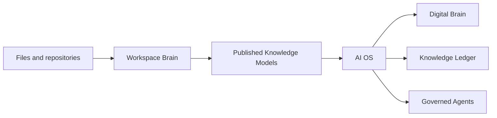

# Workspace Brain Architecture Definition Document v1

**Status:** Accepted architecture baseline  
**Product:** Workspace Brain  
**Repository:** `workspace-brain`  
**Language:** TypeScript/Node.js  
**Deployment:** Local-first Docker Compose  

## 1. Executive summary
Workspace Brain is a local-first **Knowledge Model Production Platform**. It discovers, indexes and organises knowledge from configured workspaces, repositories and documents, then publishes immutable, versioned Knowledge Models for AI OS and future agents.

Workspace Brain is not AI OS. Workspace Brain acquires and represents evidence-backed understanding. AI OS consumes Knowledge Models, governs accepted understanding, maintains its Knowledge Ledger and materialises its Digital Brain. Original repositories and files remain authoritative.

> Workspace Brain discovers and represents. AI OS governs and understands. Agents act through governed capabilities.

## 2. Boundaries and invariants
Workspace Brain owns discovery, versions, document processing, evidence, candidate entities and relationships, search projections, provenance, and Knowledge Model build/validation/publication/export.

AI OS owns the Digital Brain, Knowledge Ledger, taxonomy governance, reasoning and accepted knowledge. Workspace Brain does not autonomously modify sources or orchestrate agents.

Non-negotiable invariants:
1. Sources remain authoritative.
2. Knowledge Models are representations, not sources of truth.
3. Every relationship and assertion has evidence.
4. Every evidence item has a precise source locator and processing provenance.
5. AI output is candidate knowledge and cannot establish itself.
6. Published Knowledge Model versions are immutable.
7. AI OS consumes published contracts, never storage internals.
8. Deterministic ingestion works without AI.
9. MVP source access is read-only.
10. Vector stores, event streams and caches are rebuildable projections or transport.



## 3. Canonical concepts
- **Workspace:** logical knowledge domain spanning any number of physical sources.
- **Source:** configured acquisition provider. MVP sources are read-only filesystem mounts.
- **Repository:** version-controlled knowledge container authoritative for its contents.
- **Document:** stable artefact identity; content/parser changes create immutable Document Versions.
- **Evidence:** curated source fragment that supports, contradicts or qualifies understanding.
- **Entity:** canonical thing that can participate in relationships.
- **Relationship:** directional, typed, evidence-backed connection between entities.
- **Assertion:** structured evidence-backed claim, initially a candidate.
- **Provenance:** source, content, processing, AI and governance lineage.
- **Knowledge Model:** machine-readable, versioned representation of a defined scope.
- **Digital Brain:** AI OS governed understanding derived from one or more Knowledge Models.

## 4. Knowledge Model contract
A Knowledge Model may represent a repository, service, sub-platform, platform, workspace or organisation. One contract serves all scopes.

```text
Knowledge Model
|- metadata and scope
|- repositories and immutable versions
|- documents and immutable versions
|- curated evidence excerpts
|- entities and aliases
|- relationships and evidence links
|- assertions and evidence links
`- provenance and validation metadata
```

It includes stable identities, hashes, useful metadata, excerpts, structured entries, locators and lineage. It excludes complete repositories/documents, embeddings, model binaries, event internals and mutable AI OS state.

A model definition is mutable configuration. A generated Model Version is immutable. Lifecycle: `requested -> building -> generated -> verified -> published`, with failure, withdrawal and supersession paths.

Portable export:
```text
knowledge-model/
|- manifest.json
|- repositories.ndjson
|- documents.ndjson
|- evidence.ndjson
|- entities.ndjson
|- relationships.ndjson
|- assertions.ndjson
`- checksums.sha256
```

## 5. Knowledge lifecycle
Overall vocabulary: Discovered, Extracted, Observed, Related, Asserted, Verified, Established, Consumed, Rejected and Superseded.

Resource-specific states:
- Documents: discovered, extracted, superseded.
- Evidence: extracted, observed, verified, superseded.
- Entities: observed, verified, established, rejected, superseded.
- Relationships: observed, related, verified, established, rejected, superseded.
- Assertions: asserted, verified, established, rejected, superseded.

Workspace Brain may discover, extract, observe, relate and assert. Deterministic rules, CI or humans verify. AI cannot verify or establish.

## 6. Relationship vocabulary
MVP vocabulary: `contains`, `belongs-to`, `references`, `documents`, `depends-on`, `uses`, `implements`, `exposes`, `consumes`, `classified-as`, `derived-from`.

Relationships are directional verbs; reference does not imply dependency; source and target are known entities; supporting, contradicting and qualifying evidence are preserved.

## 7. Provenance
Layers:
1. source identity, provider and acquisition time;
2. repository/document version and precise locator;
3. processor/extractor/rule and version;
4. provider/model/digest/prompt/schema/options for AI;
5. human/CI/rule verification and establishment.

Locators are format-aware: Markdown heading/lines, JSON Pointer, source path/lines, PDF page, Excel sheet/range and PowerPoint slide. Explanation traverses knowledge item -> evidence -> document version -> repository version -> source -> processing/governance activity.

## 8. Configuration
A versioned YAML file defines platform defaults, sources, workspaces, Knowledge Models, processing, search, AI and governance. Zod is the runtime source of truth and generates JSON Schema.

```yaml
version: 1
platform:
  data_dir: /data
  hash_algorithm: sha256
sources:
  - id: projects
    type: filesystem
    container_paths: [/sources/projects]
    defaults:
      exclude_dirs: [.git, node_modules, dist, build]
      include_extensions: [.md, .txt, .yaml, .yml, .json, .ts, .js]
      max_file_size_mb: 50
      follow_symbolic_links: false
workspaces:
  - id: hmrc-agents
    name: HMRC Agents
    sources: [projects]
    repository_rules:
      include: [agent-*]
knowledge_models:
  - id: hmrc-agents-model
    scope: { type: workspace, target: hmrc-agents }
search:
  lexical: { enabled: true }
  semantic: { enabled: true }
ai:
  policy: { local_only: true, allow_remote_fallback: false }
  providers:
    - { id: local-ollama, type: ollama, endpoint: http://ollama:11434 }
governance:
  provenance_required: true
  relationships_require_evidence: true
  allow_source_mutation: false
```

## 9. Domain and aggregates
- Workspace aggregate: Workspace, source associations, rules and model definitions.
- Repository aggregate: Repository, Repository Version, analysis and memberships.
- Document aggregate: Document, Document Version and Evidence.
- Knowledge aggregate: Entity, aliases/mentions, Relationship, Assertion and lifecycle.
- Publication aggregate: Knowledge Model, immutable Version, membership, validation and manifest.

Use ULIDs rather than paths or names as durable identities.

## 10. Event model
Workspace Brain is event-driven internally and state-based externally.

```typescript
interface DomainEvent<TType extends string, TPayload> {
  eventId: string; eventType: TType; eventVersion: number;
  occurredAt: string; producer: string; correlationId: string;
  causationId?: string; idempotencyKey: string; partitionKey: string;
  payload: TPayload;
}
```

Initial events include source scan requested/started/completed/failed; repository discovered/changed/analysed/removed; document discovered/changed/extracted/failed/superseded; evidence created/superseded; entity discovered/merged; relationship observed/verified/established/rejected/superseded; assertion created/verified/established/rejected; Knowledge Model build requested/generated/verified/published/superseded.

Events describe completed facts, are immutable/versioned and carry IDs rather than large content. Consumers are idempotent, use bounded retries and dead-letter subjects, and preserve correlation/causation.

## 11. Search model
Search is a capability, not the product. It returns repositories, documents, evidence, entities, relationships, assertions and model versions, never vector records or raw rows.

Modes: metadata, lexical, semantic, hybrid, relationship and provenance. Exact identifiers remain searchable. Semantic search primarily indexes evidence and safe derived views. Results expose lifecycle, confidence, evidence and optional explanation. If Qdrant or Ollama is unavailable, search degrades explicitly.

## 12. Data and ownership
- **DuckDB:** authoritative Workspace Brain catalogue, accessed through a sole-writer catalogue service.
- **Qdrant:** rebuildable dense and future sparse-vector projection.
- **NATS JetStream:** durable event transport/replay, not domain state.
- **Ollama:** model artefacts and inference runtime only.
- **Processed artefact volume:** rebuildable normalised content.
- **Workspace Brain publication layer:** published models.
- **AI OS:** Digital Brain, Knowledge Ledger and accepted understanding.

Core DuckDB groups: migrations; sources/workspaces/rules/scans; repositories/versions/analysis; documents/versions/memberships; evidence/provenance; entities/aliases/mentions; relationships/assertions/evidence links; Knowledge Model definitions/versions/snapshot membership; jobs/idempotency/event audit/search projection records.

## 13. API contract
Base path `/api/v1`. API and Knowledge Model schema versions are independent. Long work returns `202` plus an operation resource. Use cursor pagination, ETags for mutable configuration, idempotency keys for commands and problem-details errors.

Management/catalogue surface: health, readiness, capabilities, workspaces, sources, scans, operations, repositories, documents, evidence, entities, relationships, assertions and search.

Model surface: model definitions, builds, versions, validation, publication, withdrawal, latest published, manifest, scoped resources, diff and export.

AI OS primarily consumes latest-published metadata, manifest, entities, relationships, evidence, export, explanations and search. Never expose SQL, vector-store IDs or event publication.

## 14. Service catalogue
### workspace-brain-api
OpenAPI, workspace/source management, catalogue writes and reads, operations, search orchestration, governance transitions, model validation/publication/export. It owns the sole DuckDB write boundary.

### ingestion-worker
Read-only source scanning, rules, repository/document discovery, hashes, change detection and deterministic Git metadata. Uses NATS and the catalogue contract; not Ollama or Qdrant.

### knowledge-worker
Document processing, evidence, embeddings, candidate entities/relationships and model snapshot generation. Uses NATS, catalogue ports, AI ports, vector ports and processed artefacts.

### web-ui and CLI
Use OpenAPI only. No direct storage or event access.

## 15. AI provider contract
Use capability-specific interfaces for embeddings, classification, structured extraction, summarisation and reranking. Applications depend on capabilities, not Ollama or model names. Routing is configuration-driven.

AI receives minimal selected evidence and known IDs, returns structured runtime-validated candidates, and never writes storage. Prompts, schemas, models, digests and settings are versioned. Remote fallback is never silent. Retries and repair are bounded. Normal tests use a deterministic fake provider.

MVP AI implements embeddings, entity extraction and relationship extraction. Defer summaries, assertions, reranking and agents.

## 16. Processor plug-in model
Pipeline: Source Document -> Document Processor -> Normalised Document -> Evidence Extractor -> Evidence -> Enrichment.

Processors expose ID/version, supported MIME/extensions, `supports` and `process`. Normalised blocks preserve headings, paragraphs, lists, tables, code, metadata and format boundaries/locators rather than flattening everything.

Specific processors win before generic ones. MVP: Markdown, text, YAML/JSON, OpenAPI, service taxonomy and repository metadata. Post-MVP: PDF, DOCX, XLSX, PPTX, HTML and remote sources.

## 17. Monorepo
```text
workspace-brain/
|- apps/{workspace-brain-api,ingestion-worker,knowledge-worker,web-ui,cli}
|- packages/{domain,contracts,configuration,eventing,catalogue,knowledge-models,search,provenance,ai-core,processing-core,observability,testing}
|- infrastructure/{duckdb,qdrant,nats,ollama,filesystem,git}
|- openapi/
|- config/
|- docs/{architecture,adr}
|- deploy/compose/
`- test/{contract,integration,end-to-end}
```

Dependency direction: apps -> application packages -> domain/contracts/ports; infrastructure adapters -> ports; composition roots wire both; domain has no infrastructure dependencies.

Use Node.js LTS, ESM, strict TypeScript, pnpm, Turborepo, Zod, Fastify, Vitest, Pino and OpenTelemetry-compatible instrumentation.

## 18. Docker Compose topology
Application containers: API, ingestion worker, knowledge worker and web UI. Infrastructure: NATS, Qdrant and Ollama. DuckDB is embedded behind the catalogue service on a persistent volume, not a standalone server.

Frontend network: UI and API. Internal backend network: API, workers and infrastructure. Volumes: catalogue, processed content, exports, NATS, Qdrant and Ollama. Only ingestion receives read-only source mounts. Public ports bind to localhost.

Degradation: Ollama loss pauses AI work; Qdrant loss removes semantic search; NATS loss pauses new asynchronous work; DuckDB loss makes catalogue operations unavailable.

## 19. Observability
Observe platform behaviour and knowledge evolution.
- Pino structured logs with request, operation, correlation and resource IDs.
- OpenTelemetry traces from scan to publication.
- Operational metrics for health, duration, throughput, retries and queues.
- AI metrics for model/prompt, duration, failures, validation and repair.
- Knowledge metrics for counts, lifecycle, freshness, evidence/provenance coverage and model composition.
- Audit who/when/why/what for governance and publication.

Never log complete source content, evidence text, prompts, model output, vectors, credentials or unnecessary host paths.

## 20. Security and safety
Bind locally by default; read-only source mounts; secrets outside committed config; minimise path disclosure; AI OS access is read-only; no raw SQL/vector/event endpoints. Authentication remains pluggable. Any future file mutation or agent action requires a separate governed action contract.

## 21. MVP
Included: versioned YAML; filesystem sources; multiple logical workspaces; rules and size limits; Git/document discovery; SHA-256 change detection; Markdown/text/YAML/JSON; README/ADR/OpenAPI/taxonomy recognition; evidence/provenance; limited entity and relationship types; DuckDB/NATS/Ollama/Qdrant; metadata/lexical/semantic search; repository/workspace models; build/validate/publish/export; minimal API/CLI/UI and observability.

Excluded: PDF/Office, remote connectors, assertions, graph database, agents, source writes, remote models, Digital Brain, Knowledge Ledger, multi-user remote hardening.

MVP exit: configure HMRC Agents -> scan -> process evidence -> extract candidates -> evidence-backed search -> explanation -> build/verify/publish/export immutable model -> AI OS consumes it.

## 22. Roadmap
- **v0.2:** PDF/Office, richer locators and manifests.
- **v0.3:** repository intelligence, service interactions, knowledge views and provenance search.
- **v0.4:** assertion/review lifecycle, verification rules and provenance explorer.
- **v0.5:** duplicates, staleness, missing knowledge and workspace recommendations.
- **v0.6:** SharePoint, Confluence, GitHub and Azure DevOps sources.
- **v0.7:** model diffs, context packs and mature AI OS packaging.
- **v0.8:** entity resolution, rich traversal and contradiction detection; evaluate graph storage only then.
- **v0.9:** quality scoring and reviewable suggested actions.
- **v1.0:** governed write/action contracts and agent integration.

## 23. Implementation slices
0. Architecture runway: tooling, domain, config, ADRs, Compose and health.
1. Deterministic discovery: catalogue, filesystem source, scan, versions and no-op rescan.
2. Evidence: Markdown/YAML/JSON normalisation, deterministic extraction and explanations.
3. Search: lexical first, embeddings/Qdrant, semantic/hybrid and degradation.
4. Knowledge Models: scope, snapshot, validation, publication and export.
5. AI enrichment: controlled entity/relationship candidates, review and evaluation fixtures.

## 24. Testing
Unit-test domain/schema/processors. Contract-test OpenAPI, events and exports. Integration-test DuckDB, NATS and Qdrant, with Ollama optional. End-to-end test `scan -> process -> evidence -> search -> model -> export` using a deterministic repository fixture. Normal CI must not require a live model.

## 25. Key risks
- DuckDB concurrency: sole-writer service.
- Premature microservices: three core services and modular packages.
- Hallucination: supplied evidence IDs, structured validation and candidate states.
- Model bloat: excerpts and metadata, not source copies or vectors.
- Parser loss: normalised blocks, locators, versions and fixtures.
- Staleness: hashes, immutable versions, freshness and diffs.
- AI OS coupling: contracts and exports only.
- Architecture astronautics: MVP limits; no graph DB or agent framework.

## 26. Architecture completion checklist
- [x] Vision and boundary
- [x] Core concepts and Domain Model
- [x] Knowledge Model contract/lifecycle/vocabulary/provenance
- [x] Configuration, events, search, DuckDB and OpenAPI
- [x] Services, AI, processors, ownership, monorepo, Compose and observability
- [x] MVP, roadmap and ADR catalogue

## 27. Final position
Workspace Brain is ready for implementation as a TypeScript-only, local-first Knowledge Model Production Platform. Start with a thin deterministic vertical slice. Preserve the primary invariant:

> Every published item of understanding must be explainable through evidence, content version and authoritative source.
